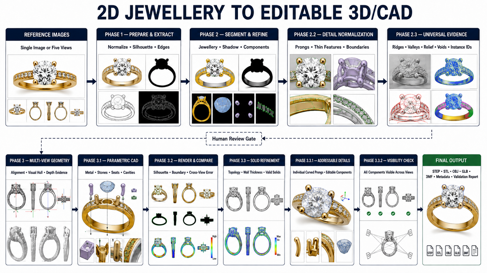

# Image-to-CAD Jewellery Reconstruction

## Development roadmap, research plan, results and validation strategy

**Document status:** Working technical plan  
**Current validated checkpoint:** Ring01 Phase 3.3.2  
**Current scope:** Rings, pendants, necklaces, ornaments, multi-stone jewellery and sculptural jewellery  
**Primary output:** Editable, component-aware CAD with traceable evidence and validation reports



## 1. Project objective

The project aims to reconstruct jewellery from one or more reference images while preserving both visible design details and editable jewellery structure.

The desired output is not only a visually similar mesh. It should identify and represent the jewellery as addressable parts:

- metal body, shank, shoulders, galleries, links and chains;
- every gemstone as an individual instance;
- stone cut, dimensions, pose and placement;
- every prong, bezel, channel, seat and cavity;
- engraved, pierced, embossed and sculptural details;
- named parameters that can change without rebuilding the complete model;
- STEP as the authoritative engineering exchange format, with STL, 3MF, OBJ or GLB as derived outputs.

For example, a ten-stone design should produce ten stable stone IDs. Removing or resizing one stone must update its seat, clearances and supporting metal without changing unrelated stones.

The long-term goal is a highly faithful and editable reconstruction. Ordinary uncalibrated images cannot prove exact hidden geometry or physical dimensions. The pipeline will therefore distinguish three levels of output:

1. **Visual reconstruction:** reproduces the appearance and silhouettes of the supplied views.
2. **Structural reconstruction:** contains plausible, individually editable jewellery components and valid topology.
3. **Manufacturing reconstruction:** adds calibrated scale, verified hidden geometry, minimum-wall and clearance rules, and physical inspection or scan evidence.

No score from the first level will be presented as proof of the third.

## 2. Current phase architecture

| Phase | Purpose | Required output | Current state |
| --- | --- | --- | --- |
| Input gate | Validate image count, naming, focus, coverage and provenance | Input manifest, hashes, view map and quality warnings | Implemented in the upload auditor; capture calibration remains optional |
| Phase 1 | Preserve and normalize image evidence | Foreground, crop transform, contours, edges, holes, symmetry and pixel measurements | Validated on Ring01 and all 120 dataset views |
| Phase 2 | Extract foreground and visible component proposals | Jewellery, stone, metal, setting, shank, support/prong and shadow masks | Machine extraction validated; not human ground truth |
| Phase 2.2 | Enforce local topology and cross-view consistency | Refined masks, amodal stone proposals and consistency report | Validated as a reconstruction initializer |
| Phase 2.3 | Preserve arbitrary fine detail and require semantic review | Evidence graph, instance IDs, cross-view track hypotheses and review decisions | Implemented; real dataset review is pending |
| Phase 3 | Build coarse multi-view geometry | Non-metric visual hull or coarse semantic reconstruction | Ring01 and dataset-wide experimental outputs exist |
| Phase 3.3 | Fit valid exact solids against every view | Editable STEP, component solids, rendered comparisons and strict report | Ring01 numerical and topology targets pass |
| Phase 3.3.1 | Make prongs individually addressable and smoothly curved | Four stable cubic claw IDs in one valid metal B-rep | Valid; image fit preserved |
| Phase 3.3.2 | Correct inspection-view ambiguity | Reference-fitted previews in which all four prongs are visible | Valid; geometry unchanged |
| Phase 4 | Build a universal component and constraint engine | Editable stones, seats, cavities, supports and dependency graph | Next major implementation phase |
| Phase 5 | Reconstruct free-form and sculptural detail | Relief/displacement evidence converted into constrained surface detail | Planned research phase |
| Phase 6 | Validate manufacturing constraints | Metric, topology, clearance, wall-thickness and casting report | Blocked until scale and manufacturing rules are supplied |

Earlier checkpoints stay immutable. A new experiment receives a new version, and a rejected experiment is recorded before backtracking.

## 3. What has been implemented and measured

### 3.1 Phase 1: deterministic image evidence

OpenCV is used for border-background estimation, normalization, Canny edges, contours, holes, connected components, morphology, symmetry and pixel-space measurements. Phase 2.3 also records internal edges, ridge and valley evidence using top-hat and black-hat transforms, local relief with Laplacian responses, negative spaces and possible highlight interference.

Why OpenCV is used:

- it is deterministic, fast and light enough to run on every input;
- geometric measurements remain inspectable instead of being hidden in a model embedding;
- it provides fallbacks when a learned segmenter is unavailable;
- it is useful for validating learned predictions with independent contour and topology checks.

Result:

- all 120 views from 24 dataset objects were processed;
- each source is preserved and associated with generated masks, edges and measurements;
- the measurements remain in pixels because no metric calibration is available.

### 3.2 Phase 2: segmentation and normalization

The current stack combines SAM 2.1 Tiny, OpenCV and GrabCut.

- **SAM 2.1 Tiny** supplies promptable whole-object and local support proposals. It was chosen because it fits the laptop GPU and can generalize without a jewellery-only training set. Meta's official implementation supports promptable image segmentation and provides the model checkpoints used by this project: [SAM 2](https://github.com/facebookresearch/sam2).
- **GrabCut** refines uncertain borders in a narrow band around the initial silhouette. This limits destructive changes to the interior of an already plausible mask.
- **OpenCV consistency rules** keep shadows disjoint from jewellery, keep visible stones inside amodal stones, keep metal inside the jewellery foreground, and measure component counts and boundary support.

Measured results:

| Test | Result | Correct interpretation |
| --- | --- | --- |
| Independent real-photo sample | SAM score `0.925781` | Model confidence only; no human mask exists for accuracy scoring |
| Real-photo GrabCut refinement | Area ratio `1.000649` relative to initial mask | Conservative boundary refinement, not proof of pixel accuracy |
| Real-photo support proposals | Four proposals, scores `0.593750` to `0.820312` | Possible supports; they are not automatically confirmed as prongs |
| Ring01 Phase 2.1 | One closed amodal stone in every view; front/top contain four prong regions | Structural consistency passed |
| Ring01 Phase 2.2 | Jewellery boundary-edge support `0.92694` to `0.98482` | Strong edge agreement with machine evidence, not ground truth |
| Ring01 Phase 2.2 | Front/top stone normalized dimension deltas `0.0268` and `0.03774` | Cross-view consistency passed; scale remains unknown |

The angled and back views demonstrate the limitation of per-image connected-component counting: occlusion and reflections produced seven and one visible prong fragments respectively. Identity must therefore come from cross-view association and human review, not one-view blob count.

### 3.3 Dataset segmentation experiment

The only current dataset contains 24 objects with five views each. The split is object-level—18 train, 3 validation and 3 test objects—so different views of one ring never leak across splits.

A 66,229-parameter U-Net was trained on the 18 training objects. It ran on CUDA for 16 epochs at 256-pixel resolution with a batch size of four.

| Metric | Result |
| --- | ---: |
| Training loss | `0.647788` to `0.140534` |
| Validation pseudo-mask IoU | `0.978183` |
| Held-out test pseudo-mask IoU | `0.977586` |
| Held-out test Dice | `0.988646` |
| Held-out test boundary F1 at 2 px | `0.999753` |

These are reproduction scores against OpenCV-derived pseudo-silhouettes. They demonstrate that a small model can learn the current normalization target. They do **not** demonstrate `97.8%` jewellery understanding, component accuracy or 3D accuracy.

### 3.4 Phase 2.3: universal detail evidence and review gate

Phase 2.3 was introduced because fixed labels such as “stone” and “prong” are not sufficient for idols, faces, filigree, reliefs, chains or unknown ornaments.

The stage:

- preserves the original image and immutable machine evidence;
- proposes local instances without forcing a jewellery label;
- assigns stable observation IDs and cross-view track hypotheses;
- supports `accept`, `reject` and `relabel` decisions;
- materializes reviewed component masks separately from machine evidence;
- blocks geometry handoff if reviews are incomplete or cross-view identities conflict.

This prevents a bright reflection from silently becoming a gemstone or a shadow from becoming a cavity in CAD.

### 3.5 Phase 3: multi-view geometry

The dataset-wide coarse reconstruction uses aligned orthographic silhouettes, voxel carving, marching cubes and Trimesh export.

| Result | Value |
| --- | ---: |
| Objects reconstructed | `24` |
| Visual-hull resolution | `128` voxels |
| Train reprojection IoU | `0.948832` |
| Validation reprojection IoU | `0.946122` |
| Test reprojection IoU | `0.961753` |
| Watertight meshes | `24 / 24` |
| Readable STL and 3MF exports | `24 / 24` |

These high values show that each hull reprojects to its own input silhouettes. A visual hull cannot recover hidden concavities, separate stones from metal or prove scale, so these models remain explicitly named `non_metric`.

### 3.6 Ring01 exact-solid refinement

Ring01 uses CadQuery/OpenCascade to construct valid parametric solids and a render-and-compare loop to fit them to all five views. Trimesh verifies derived meshes and export readability.

| Checkpoint | Mean silhouette IoU | Detail IoU | Boundary F1 | Decision |
| --- | ---: | ---: | ---: | --- |
| Phase 3 coarse | `0.744920` | — | — | Useful initialization |
| Phase 3.2 | `0.590510` | — | `0.466620` | Retained as a documented intermediate failure |
| Phase 3.3 | `0.818114` | `0.784277` | `0.795217` | Accepted exact-solid checkpoint |
| Phase 3.3.1 | `0.819726` | `0.787388` | `0.795969` | Accepted smooth, individually named prongs |
| Phase 3.3.2 | Same as Phase 3.3.1 | Same | Same | Accepted inspection-camera correction; geometry unchanged |

Phase 3.3.1 also passes these topology checks:

- one connected, closed and valid metal B-rep;
- one separate, closed and valid gemstone B-rep;
- four curved cubic prongs with stable IDs;
- open two-rail gallery;
- one shank and four shoulders;
- faceted separate stone;
- watertight derived print mesh.

The per-view silhouette IoUs are front `0.854535`, side `0.813976`, top `0.871267`, angled `0.770454` and back `0.788398`. The current weak point is fine semantic agreement: component mean IoU is only about `0.37–0.45`, and human masks are unavailable. Phase 3 therefore has a valid checkpoint but has not reached the `0.90` research target or manufacturing accuracy.

## 4. Problems encountered and what they taught us

### 4.1 Reflections were mistaken for geometry

Polished metal produces elongated highlights, while gemstones create reflection and refraction patterns that change with viewpoint. Machine masks classified some highlights as physical openings. The accepted correction filled only reviewed elongated highlight regions and preserved actual gallery openings.

**Lesson:** image intensity cannot directly define solid/empty geometry. Reflection evidence must be stored separately, and ambiguous regions require review or physically based multi-view reasoning.

### 4.2 One camera model did not fit independently framed references

A shared camera-distance experiment reduced the proxy objective from the accepted `0.561208` to `0.554328`, and front IoU fell to `0.532439`.

**Lesson:** product renders may be independently cropped or rendered. Each view needs its own camera hypothesis unless a calibrated capture proves shared intrinsics.

### 4.3 A better proxy score produced worse exact CAD

Unconstrained fitting to automatically extracted prong instances increased its local objective but reduced exact mean silhouette IoU to `0.785103`, detail IoU to `0.733825` and boundary F1 to `0.759235`. It also exported five detached metal solids.

**Lesson:** machine instance masks are diagnostic proposals. Topology constraints and exact exported-CAD validation must outrank an optimizer’s internal score.

### 4.4 Segmented curved tubes failed at Boolean seams

Piecewise cone segments approximated curved claws visually but created an invalid Boolean seam.

**Lesson:** smooth multi-section lofts are preferable for claws and organic supports because they preserve both curvature and B-rep validity.

### 4.5 A preview made an existing prong look missing

The first isometric camera aligned with a 45-degree prong axis, projecting one claw through the gemstone centre. The STEP already contained four named claws.

**Lesson:** geometry validation and presentation-camera validation are separate. Inspection views must be chosen so important parts do not occlude one another.

### 4.6 High 2D scores can hide unresolved 3D structure

Visual-hull reprojection exceeds `0.94` on the dataset, yet no camera calibration, physical scale, individual component truth or hidden-surface truth exists.

**Lesson:** every report must identify what its metric measures. Silhouette agreement, semantic accuracy, 3D surface error, topology validity and manufacturing readiness are different claims.

### 4.7 The dataset is small and incompletely labelled

The current 120 images represent only 24 independent objects. They have no paired CAD, camera parameters, dimensions, individual stones, seats or material labels.

**Lesson:** use this dataset for preprocessing, self-supervised multi-view experiments and qualitative stress tests. It cannot train or evaluate exact image-to-CAD reconstruction by itself.

## 5. Next implementation programme

### Milestone A: establish defensible ground truth

This is the immediate priority because additional optimization against unreviewed masks will only overfit machine errors.

1. Human-review all Ring01 Phase 2.3 instances and cross-view tracks.
2. Draw human foreground, metal, stone, setting, prong and negative-space masks for all five views.
3. Provide at least one known dimension—preferably stone diameter and inner-ring diameter.
4. Add camera metadata where available; otherwise record camera uncertainty explicitly.
5. Re-run Phase 3.3 against human evidence and report both old-machine-mask and new-ground-truth scores.

**Exit gate:** no unresolved review conflicts; five human masks; one metric dimension; reproducible exact-solid report.

### Milestone B: individual component and dependency engine

Create a category-independent scene graph rather than a ring-only schema.

Each component should contain:

- stable `component_id` and cross-view `track_id`;
- semantic class and confidence;
- visible and amodal masks per view;
- parent/support relationships;
- pose, dimensions and uncertainty;
- geometry generator or free-form surface reference;
- manufacturing role: metal, stone, cavity, seat, support, decoration or unknown;
- dependencies describing what must update when a parameter changes.

For every stone instance, generate a separate gemstone solid and a matched seat tool. The cavity should be a Boolean subtraction of the transformed seat tool from the metal body, with configurable girdle, pavilion, clearance and wall-thickness allowances.

**Exit gate:** a synthetic ten-stone test can remove, replace and resize any one stone; only its dependent seat/support geometry changes; all component IDs remain stable.

### Milestone C: camera, depth and multi-view correspondence benchmark

Run several geometry estimators on the same reviewed inputs rather than committing to one model:

1. COLMAP baseline for feature-based camera pose and sparse/dense reconstruction.
2. VGGT for feed-forward camera, depth, point-map and track hypotheses.
3. DUSt3R/MASt3R as research-only comparison for weakly textured or uncalibrated pairs.
4. Depth Anything V2 Small for a laptop-sized relative-depth prior.
5. DSINE for surface-normal evidence around reliefs and curved metal.

All predictions must be transformed into the project evidence schema with confidence and source provenance. They do not directly overwrite CAD.

**Exit gate:** calibrated or reviewed camera hypotheses, cross-view track consistency, and lower held-out reprojection/boundary error than the current baseline without breaking topology.

### Milestone D: free-form and sculptural detail

Parametric primitives suit shanks, stones and standard settings, but faces, idols, floral relief and hand-carved patterns require a second representation.

The proposed hybrid is:

- exact B-rep for functional and editable jewellery structure;
- local subdivision/NURBS or dense surface patches for organic relief;
- a named attachment frame that binds each patch to the B-rep;
- depth/normal/photometric evidence for the visible relief;
- symmetry only where supported by evidence;
- uncertainty masks on unobserved sides.

Blender can be used to prototype sculpting, remeshing and Boolean cutters. Accepted geometry should return to a validated exchange representation; a Blender Boolean success alone is not sufficient manufacturing validation.

**Exit gate:** relief details survive render-and-compare, are attached without floating geometry, and do not invalidate the base solid or minimum wall thickness.

### Milestone E: manufacturing validation

Add configurable rules for:

- metric scale and tolerances;
- watertight/manifold solids and self-intersections;
- minimum wall and prong thickness;
- stone-seat clearance and girdle contact;
- cavity breakthrough and trapped volumes;
- disconnected or floating metal;
- stone/metal and stone/stone collisions;
- casting, polishing and print allowances;
- mass/volume estimates by material.

The initial rules should be treated as project configuration and reviewed by a jewellery CAD/manufacturing specialist. They must not be invented from images.

**Exit gate:** a reviewed checklist passes on the authoritative STEP, and physical measurements or scans validate critical dimensions.

## 6. Algorithms and open-source projects

The project should use an ensemble: deterministic vision for measurable evidence, learned models for ambiguous perception, multi-view geometry for consistency, and exact CAD kernels for editable solids. No single model is expected to solve all four tasks.

### 6.1 In use now

| Project or algorithm | Current use | Why it fits |
| --- | --- | --- |
| [OpenCV](https://github.com/opencv/opencv) | Normalization, GrabCut, Canny, morphology, contours, components, edges and metric computation | Fast, deterministic, inspectable and CPU-friendly |
| [SAM 2](https://github.com/facebookresearch/sam2) | Prompted whole-object and local proposal masks | Strong general-purpose segmenter with a Tiny checkpoint that fits the available GPU |
| Small U-Net | Dataset silhouette learning | Only 66,229 parameters; establishes a reproducible task-specific baseline |
| Visual hull / voxel carving | Coarse multi-view volume | Preserves silhouettes and gives a conservative initialization without pretending to infer hidden concavities |
| Marching cubes | Converts carved occupancy into a mesh | Standard deterministic surface extraction from a voxel field |
| [CadQuery](https://github.com/CadQuery/cadquery) and OpenCascade | Parametric solids, lofts, Booleans and STEP export | Produces editable exact B-rep geometry instead of only triangle meshes |
| [Trimesh](https://github.com/mikedh/trimesh) | Mesh loading, validation, voxelization, smoothing and export checks | Lightweight Python geometry toolkit suitable for regression tests |
| Render-and-compare optimization | Fits CAD and camera parameters to masks | Keeps the final score tied to independently rendered exported geometry |

PyTorch3D is present in the research environment and remains useful for differentiable rendering, camera transforms and mesh losses, but the current reported Phase 3.3 results should be attributed to the repository’s exact-solid render-and-compare path, not to PyTorch3D.

### 6.2 Highest-priority additions

| Project | Proposed role | Benefits and limits | Integration priority |
| --- | --- | --- | --- |
| [Grounded SAM 2](https://github.com/IDEA-Research/Grounded-SAM-2) + [Grounding DINO](https://github.com/IDEA-Research/GroundingDINO) | Text-prompted detection followed by instance segmentation | Helps propose many small stones and repeated parts; tiled inference can help dense designs. Proposals still require stable IDs and review | High |
| [HQ-SAM / HQ-SAM 2](https://github.com/SysCV/sam-hq) | Boundary-refinement benchmark | Designed for intricate mask boundaries and offers a light variant; must be benchmarked specifically on reflective prongs and filigree | High |
| [Depth Anything V2](https://github.com/DepthAnything/Depth-Anything-V2) Small | Relative-depth prior | Small checkpoint is Apache-2.0 and realistic for the laptop; relative depth still needs cross-view alignment and metric calibration | High |
| [COLMAP](https://github.com/colmap/colmap) | Calibrated-capture SfM/MVS baseline | Mature and measurable; polished, textureless jewellery can defeat feature matching, so controlled diffuse/cross-polarized capture is important | High |
| [VGGT](https://github.com/facebookresearch/vggt) | Camera, depth, point maps and tracks | Useful feed-forward hypothesis generator. Verify the exact checkpoint license before any commercial use | High, benchmark first |
| [PyTorch3D](https://github.com/facebookresearch/pytorch3d) | Differentiable multi-view fitting | Enables silhouette, edge, depth, normal and camera losses in one optimization loop | High |
| [Blender](https://projects.blender.org/blender/blender) | Synthetic jewellery data, organic detail, Boolean experiments and physically based rendering | Excellent research workbench; accepted solids must still pass CAD/topology validation | High |
| [Manifold](https://github.com/elalish/manifold) | Robust mesh Booleans and manifold repair | Useful for derived print meshes and stress-testing complex cutters; it does not replace exact STEP construction | Medium-high |

### 6.3 Multi-view and reflective-object research candidates

| Project | Where it may help | Practical constraint |
| --- | --- | --- |
| [DUSt3R](https://github.com/naver/dust3r) | Pairwise geometry and cameras when classical matching fails | CC BY-NC-SA; research evaluation only unless licensing changes |
| [MASt3R](https://github.com/naver/mast3r) | Dense matching, local features, point maps and global alignment | Non-commercial license and checkpoint-data restrictions require careful review |
| [OpenMVS](https://github.com/cdcseacave/openMVS) | Dense point cloud, mesh reconstruction and refinement after camera recovery | AGPL license affects integration architecture; reflective surfaces remain difficult |
| [Meshroom / AliceVision](https://github.com/alicevision/Meshroom) | Reproducible external photogrammetry baseline | Best with many overlapping, sharp images; five studio views may be insufficient |
| [NeRO](https://github.com/liuyuan-pal/NeRO) | Geometry and BRDF estimation for reflective objects | Strong research match for polished metal, but substantially heavier than the current pipeline |
| [NeRSP](https://yu-fei-han.github.io/NeRSP-project/) | Reflective geometry from sparse polarized images | Requires a changed capture process with polarization; valuable controlled-capture experiment |
| [NeRRF](https://github.com/dawning77/NeRRF) | Reflection/refraction-aware research for transparent or specular objects | Experimental neural representation, not directly editable CAD |
| [SpecGloss-GS](https://github.com/gkouros/SpecGloss-GS) | Geometry/material separation for glossy objects | Very recent research; benchmark independently before integration |
| [SuGaR](https://github.com/Anttwo/SuGaR) | Surface-aligned Gaussian splatting and mesh extraction | Useful for dense appearance/detail experiments; mesh output still requires semantic and CAD conversion |
| [Neuralangelo](https://github.com/NVlabs/neuralangelo) | High-fidelity surface reconstruction from many posed images | Official defaults require at least 24 GB VRAM; unsuitable for the 4 GB laptop except heavily reduced or remote runs |
| [Nerfstudio](https://github.com/nerfstudio-project/nerfstudio) | NeRF/Gaussian-splatting baselines and mesh/point export | Good visual reconstruction laboratory, not proof of exact hidden surfaces or CAD topology |

Neural or Gaussian representations should be used as **evidence and geometric priors**, especially for visible free-form detail. Their mesh output must pass through component recovery, exact-solid reconstruction and the same validation gates as every other candidate.

### 6.4 Coarse generative 3D candidates

Models such as [TRELLIS](https://github.com/microsoft/TRELLIS), [Hunyuan3D-2](https://github.com/Tencent/Hunyuan3D-2) and [InstantMesh](https://github.com/TencentARC/InstantMesh) may provide a coarse semantic starting shape or novel-view prior. They should not be used as authoritative jewellery CAD because generated meshes can invent hidden details, merge components and violate seat, prong and wall-thickness constraints.

Their correct role is optional initialization:

1. generate a coarse hypothesis;
2. segment it into reviewed components;
3. fit parametric/free-form geometry to real image evidence;
4. discard any unsupported generated detail;
5. rebuild and validate the final CAD independently.

### 6.5 Jewellery-specific references

There is no mature open-source model found that converts arbitrary jewellery photographs directly into manufacturing-accurate, editable CAD. The closest public work is useful as reference material rather than as a complete replacement:

| Project or paper | Useful idea | Limitation for this project |
| --- | --- | --- |
| [Castable](https://github.com/JuanGaljoen/castable) | Parametric ring families, OpenCascade/build123d construction, STEP/STL and casting-oriented validation | Very new and restricted to a few ring styles; audit code and tests before borrowing patterns |
| [Segment Your Ring](https://github.com/MathieuNlp/Sam_LoRA) | Jewellery-specific SAM/LoRA experiment | Dataset contains only two ring types and the author records failures around reflections and jewellery details |
| [JewelSense](https://github.com/rafeyshah/JewelSense) | Ring detection, SAM segmentation, tracking and Open3D placement | Primarily AR fitting; it does not reconstruct manufacturing CAD from the observed design |
| [ByzantineCAD paper](https://doi.org/10.1016/j.cad.2004.07.004) | Feature-based, parametric construction of complex pierced jewellery | Valuable architecture concept, but not a modern open implementation of image-to-CAD |

The lack of a complete open solution supports the project’s hybrid approach: combine general vision and 3D research with jewellery-specific constraints and editable CAD generation.

### 6.6 Useful datasets and benchmarks

| Dataset | Possible use | Limitation |
| --- | --- | --- |
| Current 24-object jewellery set | Normalization, silhouettes, multi-view self-consistency and stress testing | No CAD, scale, cameras or component truth |
| [Amazon Berkeley Objects](https://amazon-berkeley-objects.s3.amazonaws.com/index.html) | Product-image/3D correspondence and material experiments | General products, not jewellery-specific engineering truth |
| [Fusion 360 Gallery](https://github.com/AutodeskAILab/Fusion360GalleryDataset) | CAD program and construction-sequence learning | Mechanical CAD distribution, not jewellery images |
| [Thingi10K](https://ten-thousand-models.appspot.com/) | Mesh robustness, manifold and printability tests | Uncurated triangle meshes; limited semantic consistency |
| [T-ROBI / ROBI](https://www.trailab.utias.utoronto.ca/t-robi-dataset) | Reflective and textureless-object perception benchmark | Industrial objects rather than jewellery |
| [PASMVS](https://repository.up.ac.za/items/f40f2e9d-368c-4f61-819b-49d7d2c67a6e) | Synthetic specular multi-view data with depth, masks, cameras and geometry | Domain adaptation to jewellery is still required |
| [3DReflecNet](https://arxiv.org/abs/2605.10204) | Large-scale reflective/transparent/low-texture reconstruction research | New benchmark; verify dataset availability, terms and reproducibility before adoption |

The most valuable new dataset will be project-owned synthetic-plus-real jewellery data. Blender can render exact CAD with randomized metal, gemstone optics, HDR lighting, camera poses and backgrounds while exporting perfect masks, depth, normals, component IDs and metric geometry. Real captured pieces and scans are then required to measure the synthetic-to-real gap.

## 7. Efficient experiment order for the available laptop

The current machine has a 4 GB GPU. It can support the existing OpenCV, SAM 2.1 Tiny, small U-Net, CadQuery and low-resolution visual-hull workflow. The next experiments should be ordered by evidence gained per compute cost:

1. Complete human annotation and metric calibration—high value, negligible GPU cost.
2. Benchmark HQ-SAM and Grounded SAM 2 on cropped head/detail regions.
3. Add tiled small-instance detection and stable cross-view IDs.
4. Test Depth Anything V2 Small and COLMAP on controlled captures.
5. Add PyTorch3D losses to the existing exact-solid optimizer.
6. Build the stone-seat-cavity dependency engine with synthetic CAD tests.
7. Run VGGT, DUSt3R/MASt3R, NeRO, Neuralangelo or Gaussian-splatting experiments on a larger remote GPU only after a small evaluation set and success criteria are fixed.

This avoids spending days on a heavy model before the ground truth needed to judge it exists.

## 8. Validation and acceptance gates

### 8.1 Visual and structural gate

The current Phase 3 research target is:

| Measurement | Minimum | Strong target |
| --- | ---: | ---: |
| Mean silhouette IoU | `0.80` | `0.90+` |
| Every principal view | `0.70` | `0.85+` |
| Angled-view IoU | `0.70` | `0.82+` |
| Mean detail-region IoU | `0.75` | `0.85+` |
| External boundary F1 | `0.75` | `0.88+` |
| Stable component identity | `100%` | `100%` |
| Required topology and solid checks | `100%` | `100%` |

These scores become defensible only after target masks are human-reviewed.

### 8.2 Component-editability gate

- every stone and support has a stable ID;
- no cross-view identity conflict remains;
- removing a component removes only its own geometry;
- changing a stone updates its dependent seat/cavity and required supports;
- metal and stone remain separate valid solids;
- no floating, duplicate or intersecting components remain.

### 8.3 Manufacturing gate

- physical scale is calibrated from a known measurement or scan;
- critical dimensions are compared against external measurement;
- hidden geometry is confirmed, scanned or explicitly marked inferred;
- wall, clearance, collision, manifold and casting rules pass;
- authoritative STEP opens successfully in an independent CAD application;
- derived STL/3MF is watertight and dimensionally consistent with STEP;
- a domain specialist approves manufacturing assumptions.

## 9. How reports will drive development

Every run should create a versioned folder and never overwrite an accepted checkpoint. At minimum it should contain:

```text
run_id/
├── input_manifest.json
├── environment.json
├── phase1/
│   ├── evidence.json
│   └── previews/
├── phase2/
│   ├── machine_proposals.json
│   └── masks/
├── phase2_3/
│   ├── evidence_graph.json
│   ├── review_decisions.json
│   └── reviewed_components/
├── phase3/
│   ├── fit.json
│   ├── validation.json
│   ├── comparisons/
│   └── model.step
├── manufacturing_report.json
└── decision.md
```

Each validation report should record:

- input hashes, source views and code revision;
- model/checkpoint names, versions and licenses;
- device, runtime and peak memory;
- parameters and random seed;
- machine evidence separately from human-reviewed truth;
- per-view and per-component metrics, not only averages;
- topology, solid, export and manufacturing checks;
- calibrated, inferred and unknown quantities;
- comparison-image paths;
- the exact failed gates;
- final decision: `accept`, `reject`, `backtrack` or `research_only`.

An experiment moves forward only when it improves the intended metric without regressing required topology or another principal view. Rejected approaches remain documented with their measurements so they are not accidentally repeated.

## 10. Immediate next report sequence

1. **Ground-truth report:** reviewed Ring01 masks, component IDs, known dimensions and uncertainty.
2. **Segmentation benchmark report:** SAM 2.1 Tiny versus HQ-SAM versus Grounded SAM 2 on whole jewellery, stones, prongs, negative spaces and fine details.
3. **Camera/depth benchmark report:** COLMAP, VGGT and lightweight depth/normal priors on the same calibrated capture.
4. **Phase 3.4 report:** exact-solid re-fit against human ground truth with full per-view/component comparisons.
5. **Parametric edit report:** individual stone resize/removal/replacement and automatically regenerated cavity/seat.
6. **Complex-detail report:** one face/idol/relief sample reconstructed with the hybrid B-rep plus free-form surface path.
7. **Manufacturing report:** metric and topology validation, followed by independent CAD inspection and, when available, scan-to-CAD deviation.

## 11. Definition of success

The project succeeds when a new jewellery design can pass through the same evidence, review, reconstruction and validation system without adding design-specific hard-coded assumptions.

A successful result must be:

- visibly faithful in every supplied view;
- structurally correct and individually editable;
- honest about hidden and uncertain geometry;
- metric only when physical scale is known;
- reproducible from versioned inputs, code and reports;
- valid as exact CAD before it is described as manufacturing-ready.

The roadmap therefore prioritizes better ground truth and component structure before larger generative models. Better models can improve proposals, but near-perfect jewellery reconstruction will come from combining controlled evidence, multiple algorithms, explicit human review, jewellery constraints, exact CAD and independent validation.
